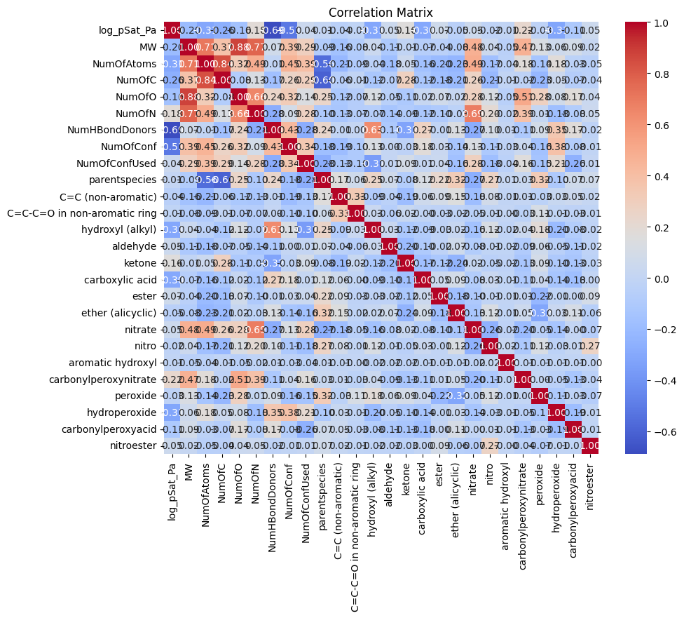
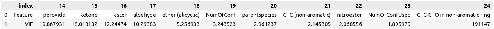
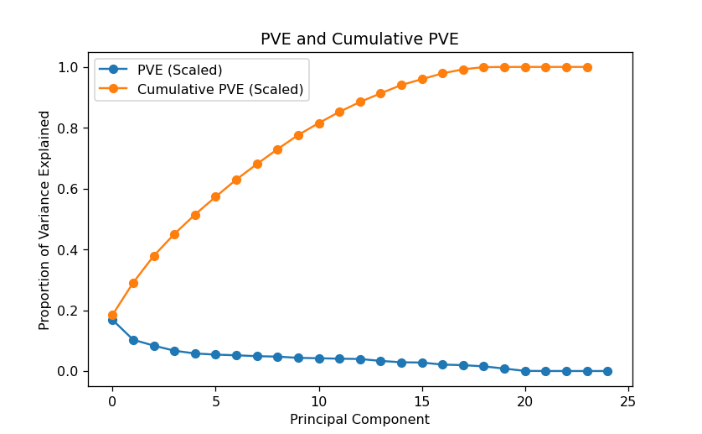
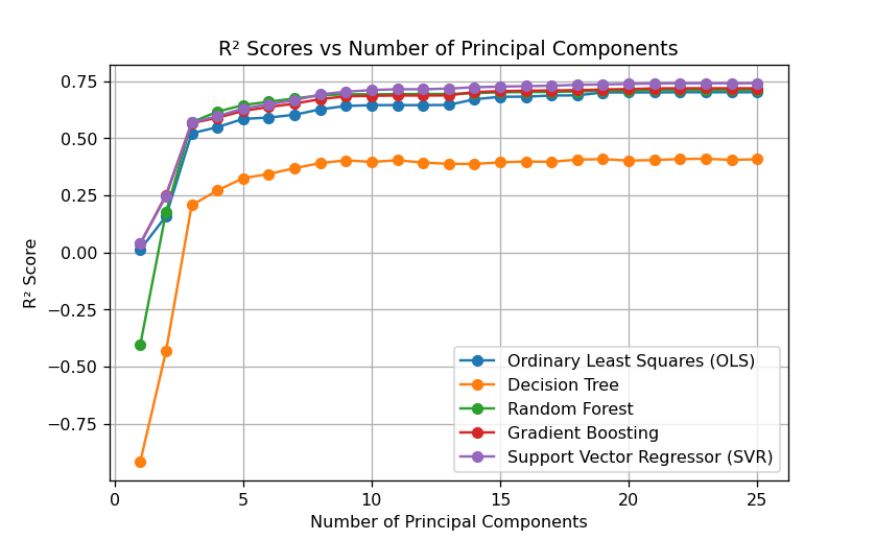

```{r setup, include=FALSE}
knitr::opts_chunk$set(echo = TRUE)
```

## Data exploration
The GeckoQ dataset contains 26 columns. The variable log_pSat_Pa is the response variable, while the remaining columns are considered predictor variables. The ID column is not related to the response variable and is therefore excluded from the exploratory data analysis. The dataset includes 24 numerical predictors and one categorical predictor. The predictor MV is a continuous variable, while the rest of the numerical predictors are discrete variables. Parentspecies is the only categorical variable.

The following chart shows the correlation between all variables in the GeckoQ dataset. The correlation matrix calculates the linear relationship between pairs of variables. A positive value indicates a positive correlation between the variables, while a negative value indicates a negative correlation. A value of +1 represents a perfect positive correlation, whereas a value of -1 represents a perfect negative correlation. Weak correlations range from 0.1 to 0.3, moderate correlations from 0.3 to 0.5, and strong correlations from 0.5 to 1.

{ width=100% }

The chart highlights that the predictors NumHBondDonors and NumOfConf have a strong negative correlation with the response variable. Moderate negative correlations with the response variable can be observed in the variables NumOfAtoms, hyfroxyl (alkyl), carboxylic acid, and hydroperoxide. No variable exhibits a moderate or strong positive correlation.

In regression problems, collinearity between predictors can cause issues, as it becomes more difficult to isolate the individual effects of each predictor on the response variable. In the upper left corner of the correlation matrix, we observe strong correlations between several predictors. Collinearity among multiple predictors can lead to multicollinearity, where predictors are highly correlated with one another.

In addition to the correlation matrix, the Variance Inflation Factor (VIF) can be used to assess multicollinearity. The following chart displays the VIF values for all variables in the GeckoQ dataset.

{ width=100% }

Multicollinearity exists in a predictor if its VIF value exceeds 10. We can see that aldehyde, ketone, ester, and peroxide exhibit high multicollinearity. Additionally, several predictors have a VIF value of infinity (inf), which indicates perfect linear dependence. This suggests that one predictor can be entirely predicted by another predictor.

-Write about outliers and skewness of the data

## Pre-processing
The data was quite clean so it did not require a lot of pre-processing. The feature "parentspecies" had 210 null values in the training data and 33 null values in the test data, so a decision had to be made on this feature.
- Standardointi yms. mallikohtaiset datan manipulointikeinot

## Feature selection
Subset selection was performed using a forward stepwise selection approach. The features were first sorted by feature importance. The best subset of features was selected by first training a model with only the most important feature selected. Then, subsequent models were trained by adding one feature at a time in order of feature importance. 

During the subset selection, each model was evaluated by performing a 5-fold cross-validation and scoring the models by the coefficient of determination. 

The feature importances were computed using the permutation feature importance technique, where the values of a single feature are randomly shuffled and the importance of this feature is determined by the level of degradation of the model's performance.  

Principal component analysis (PCA) was also done on the data set to see, whether selecting features this way would be 
beneficial. Majority of the variance in the data was explained well without the last few components.



R²-scores were also tested for, by increasing number of principal components, using multiple models to see 
where we would start seeing diminishing returns.



## Performance estimation
The performance of models was estimated using R²-score. Each model was tested by performing 10-fold cross validation 
on the training data set. The means of the scores of these cross-validation runs were used to compare the models.

## Model selection
First, several different models were trained and evaluated for reference using the default parameters. The models were trained with all features and evaluated using a 10-fold cross-validation. A simple least squares linear regression model performed surprisingly well, but the best scores were attained by nonlinear models, such as Random Forest and Support Vector Regressor (SVR).

We chose to focus on Random Forest and SVR, as we believed that these models had the most potential of the models tested. Next, feature selection and parameter tuning was performed for both models individually.