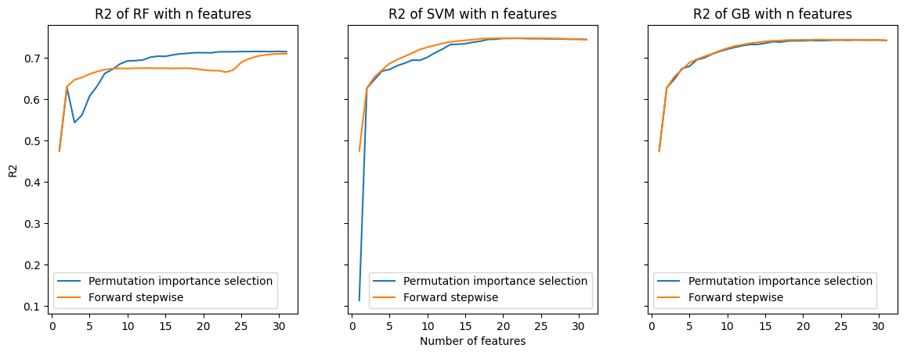
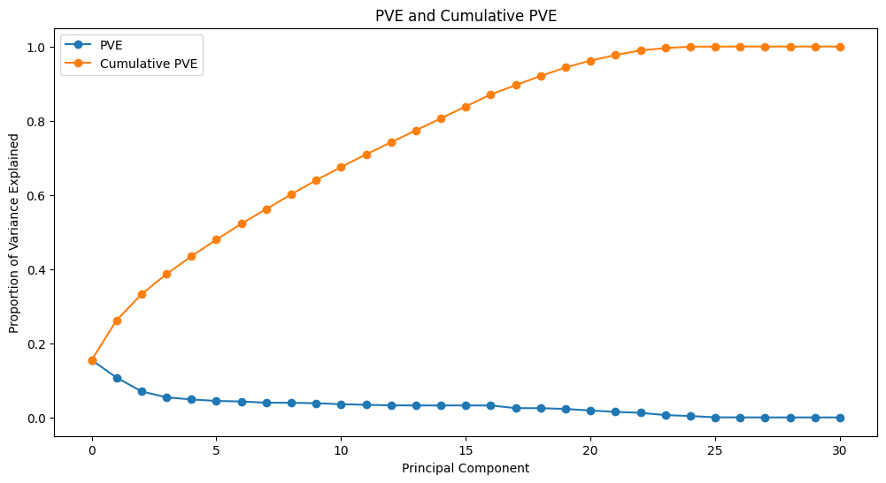
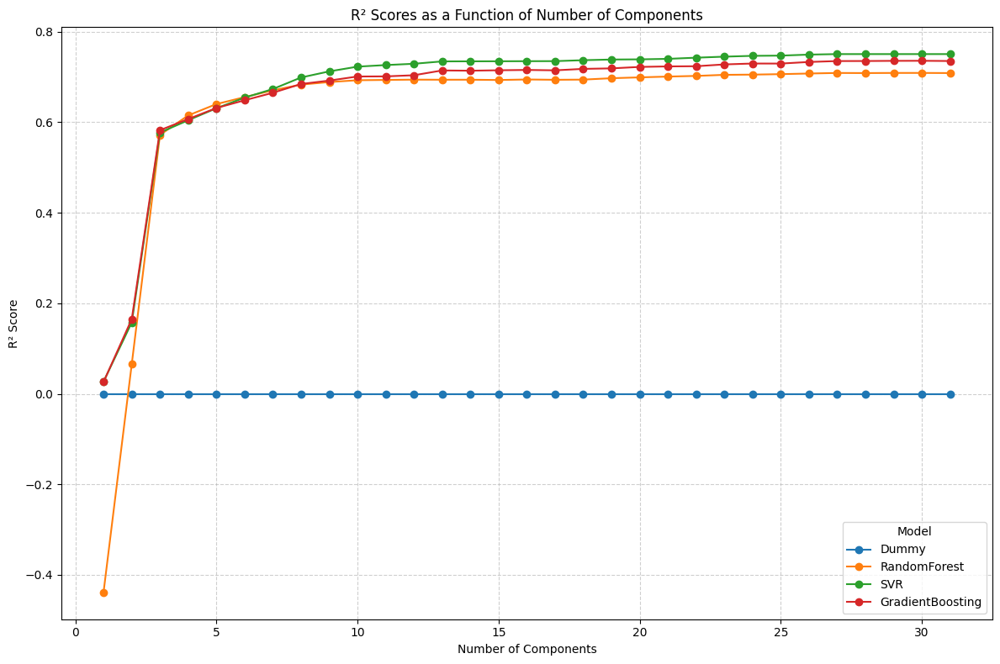

--- 
title: "Initial report" 
author: "Group 210" 
output: 
  pdf_document: default 
  html_document pdf_document: default 
header-includes:
  - \usepackage{graphicx}
bibliography: references.bib
date: "2024-12-03" 
--- 

```{r setup, include=FALSE} 
knitr::opts_chunk$set(echo = TRUE)
library(readr)
library(knitr)
library(kableExtra)
``` 
## Data exploration 
The GeckoQ dataset contains 26 columns. The variable log_pSat_Pa is the response variable, while the remaining columns are considered predictor variables. The ID column is not related to the response variable and is therefore excluded from the exploratory data analysis. The dataset includes 24 numerical predictors and one categorical predictor. The predictor MV is a continuous variable, while the rest of the numerical predictors are discrete variables. Parentspecies is the only categorical variable. 

The following chart shows the correlation between all variables in the GeckoQ dataset. The correlation matrix calculates the linear relationship between pairs of variables. A positive value indicates a positive correlation between the variables, while a negative value indicates a negative correlation. A value of +1 represents a perfect positive correlation, whereas a value of -1 represents a perfect negative correlation. Weak correlations range from 0.1 to 0.3, moderate correlations from 0.3 to 0.5, and strong correlations from 0.5 to 1. 

{ width=100% } 

The chart highlights that the predictors NumHBondDonors and NumOfConf have a strong negative correlation with the response variable. Moderate negative correlations with the response variable can be observed in the variables NumOfAtoms, hyfroxyl (alkyl), carboxylic acid, and hydroperoxide. No variable exhibits a moderate or strong positive correlation. 

In regression problems, collinearity between predictors can cause issues, as it becomes more difficult to isolate the individual effects of each predictor on the response variable. In the upper left corner of the correlation matrix, we observe strong correlations between several predictors. Collinearity among multiple predictors can lead to multicollinearity, where predictors are highly correlated with one another. 

In addition to the correlation matrix, the Variance Inflation Factor (VIF) can be used to assess multicollinearity. The following chart displays the VIF values for all variables in the GeckoQ dataset. 

{ width=100% } 

Multicollinearity exists in a predictor if its VIF value exceeds 10. We can see that aldehyde, ketone, ester, and peroxide exhibit high multicollinearity. Additionally, several predictors have a VIF value of infinity (inf), which indicates perfect linear dependence. This suggests that one predictor can be entirely predicted by another predictor. 

The boxplot can be used to analyze how observations are distributed for each feature. The boxplot chart can be found in the appendix (??). Several features exhibit outliers. These observations differ significantly from the rest of the dataset and may occur due to natural variability or measurement errors. Outliers can impact the results of machine learning models, and models trained on data with many outliers may produce misleading results.

In addition to the correlation matrix, scatterplots can provide insights into the relationships between variables. The correlation matrix shows the linear correlation between variables, while scatterplots reveal non-linear relationships between pairs of variables. The scatterplot, where the response variable is paired with each of the predictors, can be found in the appendix (??). The predictors x, y, and z, which had strong correlations in the correlation matrix, appear to exhibit similar non-linear relationships with the response variable. Additionally, the variable aromatic hydroxyl

## Pre-processing 
The data was quite clean so it did not require a lot of pre-processing. The feature "parentspecies" had 210 null values in the training data and 33 null values in the test data. Wedecided to replace the null values with the mode of the feature, which was 'toluene' (?).

Since "parentspecies" was the only categorical variable and had only x unique values, we applied the One-Hot Encoding method to it. This method converts categorical data into x binary vectors, where the column representing the original value for a given row is assigned a value of 1, while all other columns are assigned 0.

Additionally, we standardized the data depending on the machine learning method being applied. Standardization ensures that features have a mean of 0 and a standard deviation of 1. This step is essential for machine learning models like SVM and k-NN, as well as dimensionality reduction techniques such as PCA. If the data contains features with different scales, the model's performance may degrade significantly.

- SVR Standardointi 

- Parentspecies one-hot coding 

## Model selection 
First, several different models were trained and evaluated for reference using the default parameters. The models were trained with all features and evaluated using a 10-fold cross-validation. A simple least squares linear regression model performed surprisingly well, but the best scores were attained by nonlinear models, such as Random Forest and Support Vector Regressor (SVR). 
We chose to focus on Random Forest and SVR, as we believed that these models had the most potential of the models tested. Next, feature selection and parameter tuning was performed for both models individually. 

- Vertaile eka kaikki malleja niiden default parametrien kanssa 

- Valitaan SVR, RF ja GradientBoosting

### Random Forest Regression

Random Forest (RF) is an ensemble learning method, meaning that it combines predictions of multiple models
to produce a more accurate prediction [@RF1]. In the case of RF, predictions of multiple decision trees 
are combined, where model is trained on random subsets of features and data.

RF is a good candidate for our machine learning model, as it is great at handling large amount of features, and 
the model handles non-linear relationships well without needing any explicit transformations on the features [@RF2]. 
The model is also robust against overfitting.

### Gradient Boosting regression
Gradient Boosting is another ensemble technique, in which the predictive model is composed of multiple weak learners, typically decision trees. A Gradient Boosting model learns sequentially and slowly: each decision tree is fitted to the residuals of the previous tree, which represent the negative gradient of a loss function. With each decision tree, the aim is to improve slowly on the previous tree, until the algorithm converges to a local minimum. 

We considered Gradient Boosting to be a good alternative to this problem, as it can handle non-linearity and collinearity in the training data. Implementations such as LightGBM and scikit-learn's HistGradientBoostingRegressor are also pleasant to use with larger data sets, as they improve on the time complexity of the algorithm by using data structures called histograms to optimize the sorting of sample values. On the other hand, parameter tuning can be finicky with Gradient Boosting, as it can be a bit susceptible to overfitting. 

- Ajetaan SVR, RF ja GB 5-fold cross validation kaikilla feature selection metodeilla 


## Feature selection 
Two kinds of subset selection methods were performed to identify the subset of features that gave the best performance for each model: the forward stepwise selection and a selection based on permutation importances. In both methods each model was evaluated by performing a 5-fold cross-validation and scoring the models by the coefficient of determination ($R^2$) and mean squared error (MSE). The final feature subsets were chosen based on these performance metrics.

The implementation of forward stepwise selection was standard. Starting from zero features, at each point of the algorithm the features not yet fitted were iterated over and added to the model individually. At each step, the feature that improved the model performance the most was selected and the algorithm was run until every feature was added. 

In the second feature selection method the features were first sorted by feature importance. These feature importances were computed using the permutation feature importance technique, where the values of a single feature are randomly shuffled and the importance of the feature is determined by the level of degradation of the model's performance.  The best subset of features was selected by first training a model with only the most important feature selected. Then, subsequent models were trained by adding one feature at a time in order of feature importance.

Surprisingly, differences between these two subset selection methods were quite substantial with Random Forest, with the permutation importance method resulting in better scores even with models with over 20 features. For SVM and GB, the forward selection method fared better than the permutation importance selection when the number of features was fewer than 20, after which the differences were negligible.

{ width=100% } 

Principal component analysis (PCA) was also done on the data set to see, whether selecting features this way would be  beneficial. Majority of the variance in the data was explained well without the last few components, as we see that 
the curve for cumulative proportion of variance plateaus at around 24 components in the figure below. 

{ width=100% } 

R²-scores were also tested for, by increasing number of principal components, using multiple models to see  
where we would start seeing diminishing returns. The R²-scores of all models follow similar trends. The initial 
boost in performance after adding the first few components is significant, but soon we start to see less proportionally 
significant increases in performance adding components.

{ width=100% } 


## Performance estimation 

Based on the testing done on the default models, three models, SVR, GB and RF, were chosen for further optimization.
R² and MSE were chosen as the two scoring methods and each model's performance was estimated using 5-fold cross validation.

The performance of models was estimated using R²-score and MSE. Each model was tested by performing 5-fold cross validation  

on the training data set. The means of the scores of these cross-validation runs were used to compare the models. 

### RF Parameter Tuning

The workflow was the first implement a random search to find some initial best model and then to perform a grid search 
ranging over values near the best hyper parameters obtained in the random search. The best model obtained with the random search reached the R²-score of 0.734716. The the best hyper parameters for this model were:
```{r,echo=FALSE}
data <- read.csv('niklas/RF_random_top_models.csv')
kable(data, caption = "Table: Best RF Random Search Model") %>%
  kable_styling() %>%
  column_spec(3:ncol(data), width = "0.5in") %>%
  row_spec(0, angle = 15) 
```


Around this values we performed the grid search, for which the top 10 best performing models for RF were:
```{r,echo=FALSE}
data <- read.csv('niklas/RF_top_models.csv')
kable(data, caption = "Table: Top 10 RF Models") %>%
  kable_styling() %>%
  column_spec(3:ncol(data), width = "0.5in") %>%
  row_spec(0, angle = 15) 
```
We can see that the best R² score for RF occurs at around 0.735. The ranking for the top models is the exact same 
for both scoring systems. 

### Gradient Boosting Parameter Tuning
For Gradient Boosting, we chose to tune parameters "max_depth", "learning_rate", "max_iter", "min_samples_leaf", "max_features" and "max_leaf_nodes". "Max_depth" limits the depth of each constructed decision tree which can help with overfitting. "Learning_rate" affects the step size of the gradient descent optimization algorithm, with smaller value representing a smaller change in the model by each tree. "Max_iter" determines the maximum number of constructed trees, while "min_samples_leaf" determines the minimum number of samples per a leaf in the decision trees. "Max_features" limits the number of features considered at every node split while constructing the trees, which might also prevent overfitting. Finally, "max_leaf_nodes" limits the maximum number of leaves for each tree.

First a randomized search with a 5-fold cross-validation was run with larger value ranges for each parameter. The results suggested that the model performance improved with smaller values of parameters "learning_rate", "max_features" and higher values of "max_iter" and "min_samples_leaf". Based on these results, the possible value ranges of each parameter was adjusted, and a grid search with a 5-fold cross-validation was run. The final parameter tuning results are as follows:
```{r,echo=FALSE}
data <- read.csv('okko/GB_top_10_models.csv')
kable(data, caption = "Table: Top 10 RF Models") %>%
  kable_styling() %>%
  column_spec(3:ncol(data), width = "0.5in") %>%
  row_spec(0, angle = 15) 
```

We decided to train the final model with the parameters of the best performing model of this grid search. While the low value of parameter "learning_rate" and the high value of "max_iter" make the model a bit more susceptible to overfitting, the low value of "max_features" provides some regularization. This model got a public score of 0.7515 and a private score of 0.7388 in the Kaggle competition.
- SVR, RF ja GB mallien parhaiten selittävät featuret valitaan hyperparametri tuunaukseen.

- Selitään kaikkien mallien hyperparametri tuunauksesta. 

- Vertaillaan tuunauksen jälkeisiä parhaita malleja toisiinsa. 

- Valitaan paras malli kolmen mallin väliltä. 
